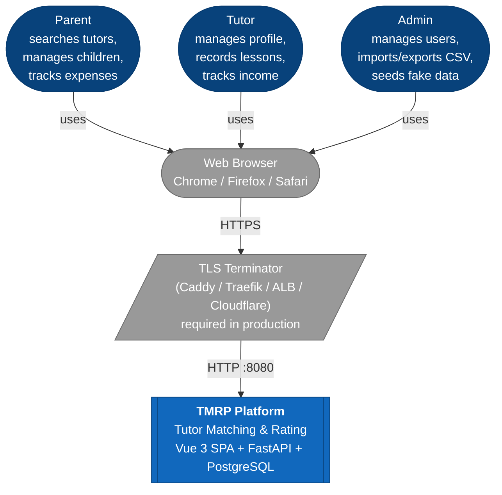
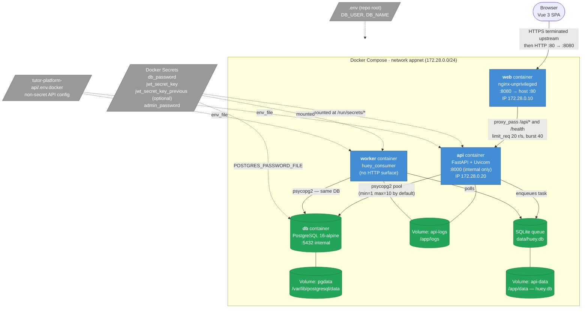
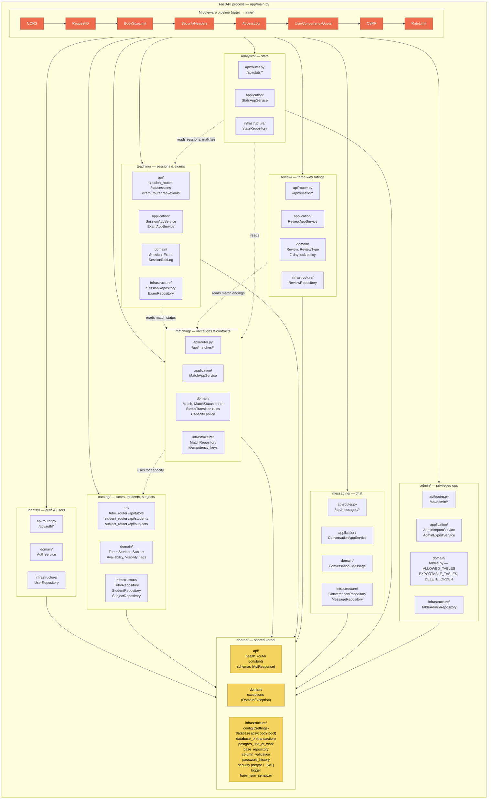
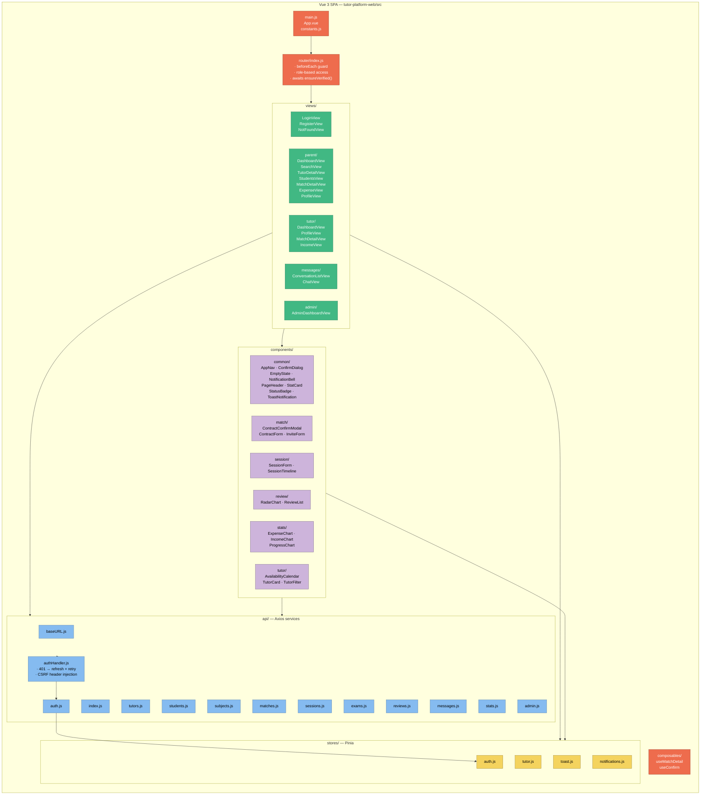
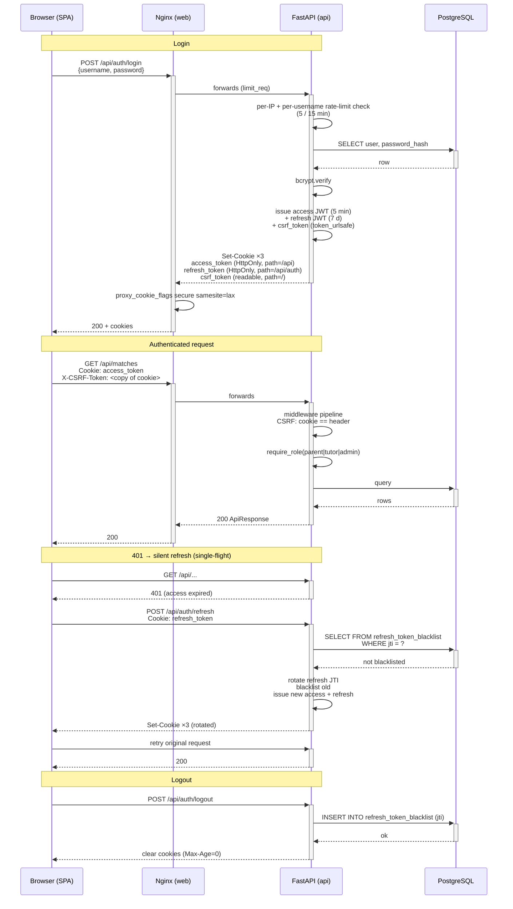
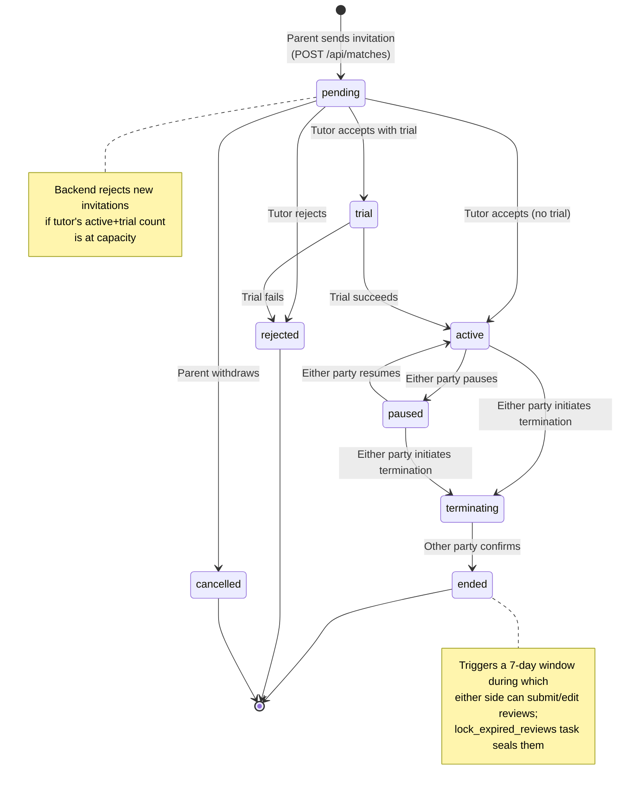
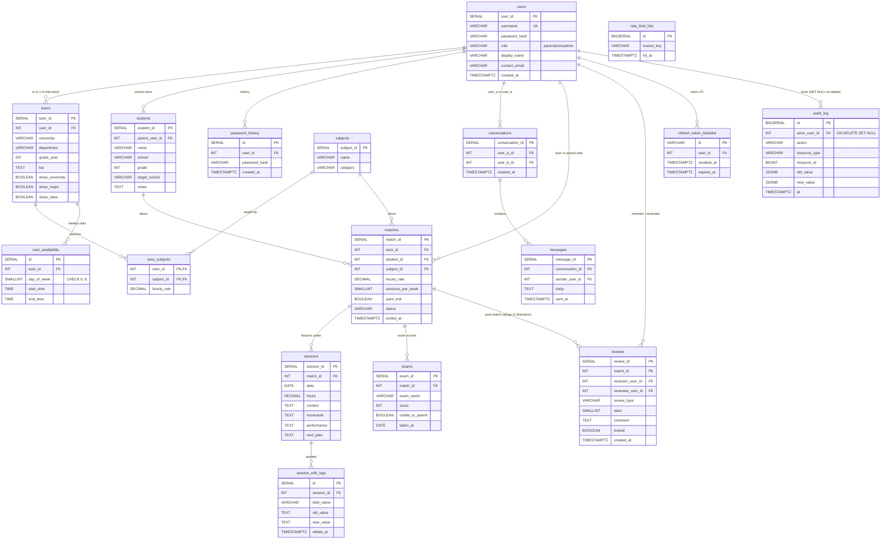
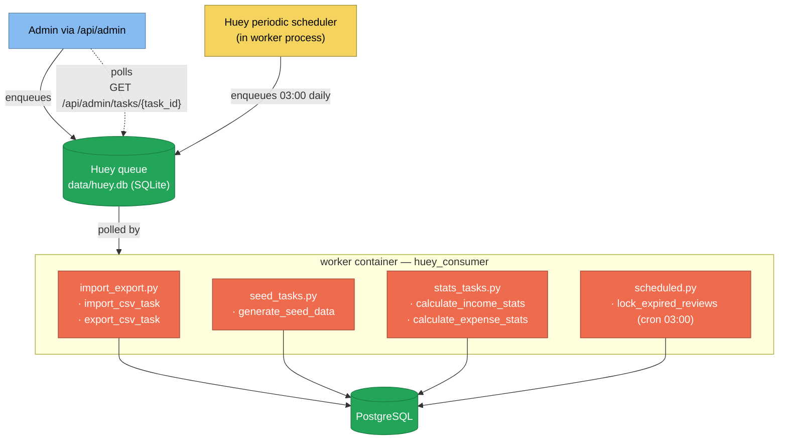

# TMRP — System Architecture

A complete architectural reference for the **Tutor Matching and Rating Platform**. This document is structured as a series of progressively deeper views, following the **C4 model** (Context → Container → Component → Code) and supplemented with cross-cutting diagrams for data, security, and runtime behaviour.

All diagrams are written in **Mermaid** so they render natively on GitHub, GitLab, VS Code, and most modern Markdown renderers without external tooling.

---

## Table of Contents

1. [Architectural Style and Principles](#1-architectural-style-and-principles)
2. [Level 1 — System Context](#2-level-1--system-context)
3. [Level 2 — Container Diagram](#3-level-2--container-diagram)
4. [Level 3 — Backend Bounded Contexts](#4-level-3--backend-bounded-contexts)
5. [Level 3 — Frontend Module Map](#5-level-3--frontend-module-map)
6. [Network and Deployment Topology](#6-network-and-deployment-topology)
7. [Request Path and Middleware Pipeline](#7-request-path-and-middleware-pipeline)
8. [Authentication and Session Flow](#8-authentication-and-session-flow)
9. [Match Lifecycle State Machine](#9-match-lifecycle-state-machine)
10. [Database Schema (ER View)](#10-database-schema-er-view)
11. [Background Tasks and Scheduling](#11-background-tasks-and-scheduling)
12. [Cross-Cutting Concerns](#12-cross-cutting-concerns)
13. [Quality Attributes and Trade-offs](#13-quality-attributes-and-trade-offs)
14. [Component Inventory](#14-component-inventory)

---

## 1. Architectural Style and Principles

TMRP is a **four-process, single-database, monolithic-modular** web application. The codebase is organised by **bounded context** (DDD) inside a single FastAPI deployable, with a clear separation between **`api`**, **`application`**, **`domain`**, and **`infrastructure`** layers per context. The frontend is a **Vue 3 SPA** served by Nginx, which also functions as the reverse proxy in front of the API.

| Principle | How it manifests |
|---|---|
| **Modular monolith** | One FastAPI process; routers grouped by bounded context (`identity`, `catalog`, `matching`, `teaching`, `review`, `messaging`, `analytics`, `admin`). |
| **Layered DDD per context** | Each context owns its `api/` (HTTP), `application/` (orchestration), `domain/` (entities, value objects, domain services), and `infrastructure/` (repositories, persistence). |
| **Backend-enforced invariants** | The status machine, review lock, tutor capacity, rating visibility, and edit-history capture are implemented server-side. The frontend renders state, never validates business rules. |
| **Defence-in-depth security** | Edge rate limit (Nginx) → outer middleware stack (FastAPI) → domain checks → DB constraints. JWTs in HttpOnly cookies + double-submit CSRF token. |
| **Idempotent bootstrap** | `init_db.py` uses `CREATE TABLE IF NOT EXISTS`, runs under a Postgres advisory lock, and refuses to start with placeholder secrets. |
| **Async work isolation** | Long-running and scheduled jobs run in a dedicated `worker` container under Huey, sharing only the Postgres database and a SQLite queue file with the API. |
| **No host exposure of internal services** | Production compose binds *only* the web container's port 80; API, DB, and worker are reachable only inside the bridge network. |

---

## 2. Level 1 — System Context

The outermost view: who interacts with TMRP and through what channels.



**Notes**
- TMRP has **no third-party integrations** in the current revision: no payment gateway, no email/SMS provider, no OAuth IdP, and no real-time message bus. Every external interaction is a browser-originated HTTP request.
- TLS termination is **out-of-scope for the compose stack** — the `web` container's `nginx-unprivileged` image listens on plain HTTP 8080. The `Strict-Transport-Security` header and `COOKIE_SECURE` flag are only meaningful when an upstream TLS terminator sets `X-Forwarded-Proto: https`.

---

## 3. Level 2 — Container Diagram

The four runtime processes that make up the system, their persistent stores, and the channels between them.



**Container responsibilities**

| Container | Image / Build | Port | Purpose |
|---|---|---|---|
| `web` | Build from `tutor-platform-web/Dockerfile` (multi-stage: Vite build → nginx-unprivileged) | 8080 internal, 80 on host | Serves SPA static assets, reverse-proxies `/api/*` and `/health`, applies edge rate limit and security headers. Pinned IP 172.28.0.10 so the API can trust its `X-Forwarded-For`. |
| `api` | Build from `tutor-platform-api/Dockerfile` | 8000 (no host binding in prod) | FastAPI app exposing `/api/*` and `/health`. Initialises the DB schema on startup, then accepts requests. |
| `worker` | Same image as `api`, command override `huey_consumer app.worker.huey` | none | Consumes the SQLite-backed Huey queue, runs CSV import/export, seed generation, stats aggregation, and the daily review-lock scheduler. |
| `db` | `postgres:16-alpine` (digest-pinned) | 5432 internal | Primary store. Single Postgres instance, runs as UID 70, all capabilities dropped. |

**Cross-process state**
- `pgdata` — Postgres data directory (durable).
- `api-data` — shared between `api` and `worker`; holds `huey.db` (the Huey SQLite queue).
- `api-logs` — shared mount for structured access / app logs.
- The DB also holds three **shared-state tables** that let multiple API replicas coordinate: `refresh_token_blacklist`, `rate_limit_hits`, `audit_log`.

---

## 4. Level 3 — Backend Bounded Contexts

The FastAPI process is divided into **eight bounded contexts** plus a **shared kernel**. Each context follows the same internal layering.



**Routing summary** (mounted in `app/main.py`)

| Prefix | Router file | Bounded context |
|---|---|---|
| `/health` | `shared/api/health_router.py` | shared |
| `/api/auth` | `identity/api/router.py` | identity |
| `/api/tutors` | `catalog/api/tutor_router.py` | catalog |
| `/api/students` | `catalog/api/student_router.py` | catalog |
| `/api/subjects` | `catalog/api/subject_router.py` | catalog |
| `/api/matches` | `matching/api/router.py` | matching |
| `/api/sessions` | `teaching/api/session_router.py` | teaching |
| `/api/exams` | `teaching/api/exam_router.py` | teaching |
| `/api/reviews` | `review/api/router.py` | review |
| `/api/messages` | `messaging/api/router.py` | messaging |
| `/api/stats` | `analytics/api/router.py` | analytics |
| `/api/admin` | `admin/api/router.py` | admin |

**Per-context layering** is enforced by directory convention:
- `api/` — FastAPI routers, Pydantic schemas, dependency providers. The only layer that knows about HTTP.
- `application/` — orchestrators that compose domain services and repositories within a unit-of-work transaction.
- `domain/` — pure business logic: entities, value objects, domain services. No I/O.
- `infrastructure/` — psycopg2-based repositories implementing domain ports.

The shared kernel (`app/shared/`) provides the connection pool, transaction helper, base repository, password hashing, JWT issuance/verification, and the unified `ApiResponse` envelope.

---

## 5. Level 3 — Frontend Module Map



**Routing table** (`router/index.js`)

| Path | Name | Guard |
|---|---|---|
| `/login`, `/register` | Login / Register | `meta.guest` — redirects to role home if already authed |
| `/parent`, `/parent/search`, `/parent/tutor/:id`, `/parent/students`, `/parent/match/:id`, `/parent/expense`, `/parent/profile` | Parent surface | `requiresAuth`, `role: 'parent'` |
| `/tutor`, `/tutor/profile`, `/tutor/match/:id`, `/tutor/income` | Tutor surface | `requiresAuth`, `role: 'tutor'` |
| `/messages`, `/messages/:id` | Messaging | `requiresAuth`, `roles: ['parent','tutor']`, `excludeRoles: ['admin']` |
| `/admin` | Admin | `requiresAuth`, `role: 'admin'` |
| `/` | Redirect | Resolves to role home or `/login` |
| `/:pathMatch(.*)*` | NotFound | Catch-all 404 |

The router guard awaits `auth.ensureVerified()` on every protected navigation, which calls `GET /api/auth/me` to validate that the role cached in `localStorage` matches the server's view of the session — closing the LocalStorage-poisoning vector.

**API client layer** uses an Axios instance with `withCredentials: true` so HttpOnly auth cookies are sent cross-origin. `authHandler.js` implements:
- 401 interception with a single-flight refresh-and-retry against `/api/auth/refresh`
- Automatic injection of the `X-CSRF-Token` header read from the non-HttpOnly `csrf_token` cookie (double-submit pattern).

---

## 6. Network and Deployment Topology

```mermaid
graph LR
    classDef public fill:#ee6c4d,stroke:#a14a35,color:#fff
    classDef edge fill:#f4d35e,stroke:#a08a3c,color:#000
    classDef internal fill:#85bbf0,stroke:#5d82a8,color:#000
    classDef store fill:#23a559,stroke:#1a7c43,color:#fff

    Internet[("🌍 Internet")]:::public
    TLS[/"TLS Reverse Proxy<br/>Caddy / Traefik / ALB / Cloudflare<br/>terminates HTTPS<br/>sets X-Forwarded-Proto: https"/]:::edge

    subgraph Host["Docker Host"]
        direction LR
        HostPort[("Host :80")]:::edge
        subgraph Net["Bridge network appnet · 172.28.0.0/24"]
            Web2["web · nginx<br/>:8080<br/>172.28.0.10<br/>cap_drop: ALL<br/>no-new-privileges"]:::internal
            Api2["api · uvicorn<br/>:8000<br/>172.28.0.20<br/>FORWARDED_ALLOW_IPS=<br/>127.0.0.1, 172.28.0.10"]:::internal
            Worker2["worker · huey_consumer<br/>cap_drop: ALL"]:::internal
            Db2[("db · postgres:16<br/>:5432<br/>UID 70<br/>cap_drop: ALL")]:::store
        end
    end

    Internet -->|HTTPS 443| TLS
    TLS -->|HTTP, with X-Forwarded-Proto| HostPort
    HostPort -->|"80 → 8080"| Web2
    Web2 -->|"limit_req 20 r/s burst 40<br/>proxy_pass /api/* and /health<br/>proxy_cookie_flags secure samesite=lax<br/>X-Forwarded-For = $remote_addr"| Api2
    Api2 -->|"psycopg2 pool"| Db2
    Worker2 -->|"psycopg2"| Db2
    Api2 -.->|"writes huey.db"| Worker2
```



### docker-compose layering

| File | Role | Notable differences |
|---|---|---|
| `docker-compose.yml` | Production base. | No host port bindings on `db` or `api`. Resource limits per service. Pinned image digests. Custom bridge with fixed IPs. |
| `docker-compose.override.yml` | Auto-loaded in local dev. | Binds `db→127.0.0.1:5433`, `api→127.0.0.1:8001` so Swagger and `psql` work from the host. |
| `docker-compose.run.yml` | Local-Postgres alternative. | `DEBUG=true`, `COOKIE_SECURE=false`. Drops API port bindings. Used when running Postgres outside Docker. |

### Container hardening (applied uniformly to db, api, worker, web)
- `security_opt: no-new-privileges:true`
- `cap_drop: [ALL]`
- Non-root UIDs (Postgres UID 70; nginx-unprivileged UID 101; the API image sets `USER` in its Dockerfile)
- Pinned base-image SHA digests via `scripts/pin-base-images.sh`
- Memory and CPU caps via `deploy.resources.limits`

### Secrets handling
- All cryptographic material is mounted as Docker secrets at `/run/secrets/*` — *never* placed in environment variables or `.env` files.
- The API entrypoint reads `/run/secrets/db_password` and constructs `DATABASE_URL` at runtime so the password never appears in `docker inspect` output.
- Startup-time `Settings` validation (`shared/infrastructure/config.py`) refuses to boot with placeholder secrets, weak admin passwords, or `ENABLE_DOCS=true && DEBUG=false`.

---

## 7. Request Path and Middleware Pipeline

A single HTTP request traverses a fixed sequence of gates. The middleware order is asserted in `app/main.py` — Starlette runs the *last-registered* middleware *outermost*, so requests flow outer → inner.

```mermaid
flowchart LR
    classDef edge fill:#f4d35e,stroke:#a08a3c,color:#000
    classDef mw fill:#ee6c4d,stroke:#a14a35,color:#fff
    classDef handler fill:#85bbf0,stroke:#5d82a8,color:#000
    classDef store fill:#23a559,stroke:#1a7c43,color:#fff

    Browser([Browser])
    Edge["Nginx edge<br/>limit_req 20 r/s burst 40<br/>security headers<br/>HSTS (if X-FP=https)<br/>proxy_cookie_flags"]:::edge
    M1[CORSMiddleware]:::mw
    M2[RequestIDMiddleware<br/>injects X-Request-ID]:::mw
    M3[BodySizeLimitMiddleware<br/>cap MAX_REQUEST_BODY_BYTES]:::mw
    M4[SecurityHeadersMiddleware<br/>X-Content-Type-Options<br/>X-Frame-Options<br/>Referrer-Policy · CSP · HSTS]:::mw
    M5[AccessLogMiddleware<br/>structured JSON · request_id]:::mw
    M6[UserConcurrencyQuota<br/>≤ 5 in-flight per user<br/>429 + Retry-After]:::mw
    M7[CSRFMiddleware<br/>double-submit token check<br/>on mutating verbs]:::mw
    M8[RateLimitMiddleware<br/>per-IP + per-user buckets<br/>persisted in rate_limit_hits]:::mw
    Auth["require_role() dependency<br/>JWT verify (HttpOnly cookie or Bearer)<br/>JWT_SECRET_KEY_PREVIOUS rotation window"]:::mw
    Route["Router handler<br/>(application service)"]:::handler
    Repo["Repository<br/>psycopg2 + UnitOfWork transaction"]:::handler
    Pg[("PostgreSQL<br/>row + advisory locks")]:::store

    Browser --> Edge --> M1 --> M2 --> M3 --> M4 --> M5 --> M6 --> M7 --> M8 --> Auth --> Route --> Repo --> Pg
```



### Middleware reference

| Layer | File | Responsibility |
|---|---|---|
| `CORSMiddleware` | (Starlette built-in) | Origin allow-list from `CORS_ORIGINS`; `allow_credentials=True` so cookies cross origins. Allowed headers include `X-CSRF-Token` and `X-Requested-With`. |
| `RequestIDMiddleware` | `middleware/request_id.py` | Generates `X-Request-ID` per request, propagates to logs and 500-error response headers. |
| `BodySizeLimitMiddleware` | `middleware/body_size_limit.py` | Rejects oversized payloads before the handler reads them (default 50 MB). |
| `SecurityHeadersMiddleware` | `middleware/security_headers.py` | Adds `X-Content-Type-Options`, `X-Frame-Options`, `Referrer-Policy`, conservative CSP, and HSTS (when proxied as HTTPS). |
| `AccessLogMiddleware` | `middleware/access_log.py` | Structured JSON access log per response, tagged with `request_id`. |
| `UserConcurrencyQuotaMiddleware` | `middleware/user_quota.py` | Caps simultaneous in-flight requests per authenticated user (default 5, `DB_PER_USER_QUOTA`). Returns 429 with `Retry-After: 1`. |
| `CSRFMiddleware` | `middleware/csrf.py` | Double-submit cookie check on mutating methods. The `csrf_token` cookie (non-HttpOnly) is mirrored into the `X-CSRF-Token` header by the SPA. |
| `RateLimitMiddleware` | `middleware/rate_limit.py` | Per-IP and per-user token buckets persisted in the `rate_limit_hits` table so limits are consistent across API replicas. Cleanup task runs periodically. |
| `require_role()` | `identity/api/dependencies.py` | Per-route role assertion. Unauthorised → 401, wrong role → 403. |

### Edge layer (Nginx)
- `limit_req_zone $binary_remote_addr zone=api_edge:10m rate=20r/s;` (`burst=40 nodelay`).
- `proxy_cookie_flags ~.* secure samesite=lax` enforces cookie flags even if the backend forgets.
- `X-Forwarded-For` is **overwritten** with `$remote_addr` (not `$proxy_add_x_forwarded_for`) so a client cannot spoof the audit-log IP.
- Dotfile requests (`/.git`, `/.env`) return 403.
- `/index.html` is served `Cache-Control: no-store`; `/assets/*` is `Cache-Control: public, immutable` (Vite fingerprints filenames).

---

## 8. Authentication and Session Flow

Login establishes three cookies; subsequent requests carry them automatically. Refresh is single-flight on the client.



**Hardening notes**
- Access tokens are **not** revoked on logout — the design relies on the short TTL (default 5 min, hard-capped at 10 by a `lifespan` check). Refresh tokens are revoked via `refresh_token_blacklist` so revocation is consistent across API replicas.
- `JWT_SECRET_KEY_PREVIOUS` + `JWT_SECRET_KEY_PREVIOUS_EXPIRES_AT` (≤ 7 days out) allow zero-downtime key rotation.
- `password_history` keeps the last five bcrypt hashes per user; `change-password` rejects reuse.
- Login uses **per-IP** *and* **per-username** rate limits to defeat distributed credential-stuffing without becoming an enumeration oracle.
- `idempotency_keys` table (used by `POST /api/matches`) makes critical writes safe under client retries.

---

## 9. Match Lifecycle State Machine

The core domain workflow — invariants enforced server-side in `matching/domain/`.



Each `(current_status, action)` pair maps to a permitted set of roles. `MatchAppService` validates both before applying any transition. The frontend's `useMatchDetail` composable mirrors the same enum but never *gates* the action — it only renders available buttons.

---

## 10. Database Schema (ER View)

17 tables: 14 business + 3 support. All timestamps are `TIMESTAMPTZ` with `NOW()` defaults.



**Notable constraints**
- `tutor_subjects` — composite PK `(tutor_id, subject_id)`.
- `conversations` — unique index on `(user_a_id, user_b_id)` to prevent duplicate threads (callers normalise so `user_a_id < user_b_id`).
- `reviews` — unique index on `(match_id, reviewer_user_id, review_type)` — one review per reviewer per match per direction.
- `tutor_availability.day_of_week` — `CHECK BETWEEN 0 AND 6`.
- `audit_log.actor_user_id` uses `ON DELETE SET NULL`; `resource_id` is a soft reference (no FK) so audit records survive row deletion.
- Schema bootstrap (`init_db.run_bootstrap`) is idempotent and serialised across uvicorn workers via a Postgres advisory lock.

---

## 11. Background Tasks and Scheduling



| Task | Module | Trigger | Purpose |
|---|---|---|---|
| `import_csv_task` | `tasks/import_export.py` | Admin upload | Bulk import a CSV into a whitelisted table (upsert / overwrite). Validates column names against `ALLOWED_TABLES` to prevent SQL injection via dynamic identifiers. |
| `export_csv_task` | `tasks/import_export.py` | Admin action | Stream a table to CSV. Restricted to `EXPORTABLE_TABLES`. |
| `generate_seed_data` | `tasks/seed_tasks.py` | Admin action | Populate the database with realistic Faker-style data for demos. |
| `calculate_income_stats` | `tasks/stats_tasks.py` | Admin / on-demand | Aggregate tutor earnings by month × student × subject. |
| `calculate_expense_stats` | `tasks/stats_tasks.py` | Admin / on-demand | Aggregate parent spending by month × subject. |
| `lock_expired_reviews` | `tasks/scheduled.py` | Daily 03:00 | Mark reviews older than 7 days as immutable (`locked=true`). |

The Huey instance lives in `app/worker.py`; the API enqueues by importing the same `huey` object. JSON serialisation uses `huey_json_serializer.py` so payloads survive worker restarts and process boundaries safely.

---

## 12. Cross-Cutting Concerns

### Configuration
- All settings flow through `app/shared/infrastructure/config.py::Settings` — a Pydantic `BaseSettings` with **boot-time validation** that refuses to start when:
  - `JWT_SECRET_KEY` is the placeholder default or shorter than 32 hex chars.
  - `ADMIN_PASSWORD` is the placeholder default or fails the strength policy (≥ 16 chars; lower + upper + digit + symbol).
  - `JWT_SECRET_KEY_PREVIOUS` is set without a valid `JWT_SECRET_KEY_PREVIOUS_EXPIRES_AT` ≤ 7 days out, or is identical to the current key.
  - `COOKIE_SECURE=false` while `DEBUG=false`.
  - `ENABLE_DOCS=true` while `DEBUG=false`.

### Persistence
- Single psycopg2 connection pool (`shared/infrastructure/database.py`) with `init_pool()` and `close_pool()` invoked by FastAPI's `lifespan`.
- `database_tx.transaction(conn)` is a context manager wrapping commit/rollback, used by routers and application services.
- `postgres_unit_of_work.py` provides a unit-of-work facade that bundles multiple repositories under one transaction.
- Repositories inherit from `base_repository.py` and call `column_validation.py` whenever building dynamic SQL, defending against identifier injection in admin import/export.

### Logging and observability
- `logger.py` configures a single root logger producing structured JSON.
- `RequestIDMiddleware` injects `X-Request-ID` end-to-end; every log line carries it.
- 500 responses surface the `request_id` in the response **header** (not body, to avoid request fingerprinting) for support correlation.
- DB-driver exception class names are scrubbed from logs (`UndefinedTable`, `IntegrityError`, …) so log sinks shipped to third parties don't double as a stack fingerprint.
- `audit_log` table records privileged actions: actor, action, resource type/ID, and old/new value JSON.

### Error handling
| Exception → status | Handler |
|---|---|
| `DomainException` → its own `status_code` | `domain_exception_handler` |
| `RequestValidationError` → 422 | `validation_exception_handler` (scrubs raw `input`/`ctx` and rewrites `msg` for sensitive fields) |
| `StarletteHTTPException` → status | `http_exception_handler` |
| Unhandled `Exception` → 500 | `unhandled_exception_handler` (logs traceback, returns generic body, exposes `X-Request-ID`) |

### Security at a glance
| Layer | Control |
|---|---|
| Edge | Nginx `limit_req` 20 r/s burst 40; security headers; `proxy_cookie_flags` enforces `Secure; SameSite=Lax`; XFF overwritten to peer IP; dotfile deny. |
| Transport | HSTS emitted only when `X-Forwarded-Proto: https`. TLS terminator required upstream in production. |
| Auth | Bcrypt password hashing; short-lived JWT in HttpOnly cookies; refresh-token blacklist; CSRF double-submit token; per-username login limits. |
| Authorisation | `require_role()` dependency; route-level role checks; `excludeRoles` on the messaging surface. |
| API hardening | Concurrency quota; body-size limit; structured 422 with sensitive-field scrubbing; idempotency keys on critical writes. |
| Container | Non-root, `cap_drop: ALL`, `no-new-privileges`, pinned digests, resource limits. |
| Data | DB password as Docker secret (never in env); admin password strength validated at boot; `ENABLE_DOCS` gated independently of `DEBUG`. |

The full deployment checklist lives in `SECURITY.md`.

---

## 13. Quality Attributes and Trade-offs

| Attribute | Approach | Conscious trade-off |
|---|---|---|
| **Simplicity** | Single FastAPI process, single DB, no message broker. | Polling-based chat; horizontal scaling untested. |
| **Operability** | Idempotent bootstrap; one healthcheck per service; structured JSON logs; unified error envelope. | First-boot start_period of 90 s for the API. |
| **Security** | Defence in depth (edge + middleware + domain + DB). Boot-time secret validation. | Higher developer friction during first-time setup. |
| **Correctness** | Server-enforced state machine, review lock, capacity check; unit-of-work transactions. | More code per endpoint than thin CRUD wrappers. |
| **Auditability** | `audit_log` for privileged actions; `session_edit_logs` for lesson edits; `password_history` for change reuse. | Storage growth on `audit_log` and `rate_limit_hits` (mitigated by periodic cleanup). |
| **Portability** | Pure Docker Compose. No cloud-specific services. | TLS termination is the operator's responsibility. |
| **Performance** | psycopg2 pool; per-user concurrency quota prevents one client from monopolising pool slots; edge cache headers on `/assets/*`. | No DB read replica; no application-level cache. |

### Known limitations (acknowledged in `README.md`)
- **Chat is polling-based**, not WebSocket. `messaging` exposes plain HTTP endpoints; the SPA polls.
- **Single-node** compose. Horizontal scaling is *possible* (rate-limit and refresh-token blacklist state already in DB) but unexercised.
- **No payment, email, or OAuth integrations** — the platform is self-contained.

---

## 14. Component Inventory

A flat reference for traceability — every named module in the running system.

### Backend (`tutor-platform-api/app/`)
```
main.py                        FastAPI app, middleware wiring, exception handlers, lifespan
init_db.py                     Schema DDL, subject seeds, admin bootstrap (advisory-locked)
worker.py                      Huey instance shared by api enqueuer and worker consumer

middleware/
  request_id.py                X-Request-ID injection
  body_size_limit.py           pre-handler payload cap
  security_headers.py          CSP / X-Frame / Referrer-Policy / HSTS
  access_log.py                structured JSON access log
  user_quota.py                per-user concurrency cap (default 5)
  csrf.py                      double-submit cookie validation
  rate_limit.py                per-IP + per-user buckets, persisted

shared/
  api/health_router.py         /health
  api/schemas.py               ApiResponse envelope
  api/constants.py             pagination defaults
  domain/exceptions.py         DomainException hierarchy
  infrastructure/config.py     Settings (Pydantic) + boot-time validation
  infrastructure/database.py   psycopg2 pool
  infrastructure/database_tx.py transaction context manager
  infrastructure/postgres_unit_of_work.py
  infrastructure/base_repository.py
  infrastructure/column_validation.py  SQL identifier whitelisting
  infrastructure/password_history.py
  infrastructure/security.py   bcrypt, JWT issue/verify, reset-confirm tokens
  infrastructure/logger.py
  infrastructure/huey_json_serializer.py

identity/   api/{router,dependencies,schemas} · domain/services · infrastructure
catalog/    api/{tutor_router,student_router,subject_router} · domain · infrastructure
matching/   api/{router,dependencies,schemas} · application/match_app_service · domain · infrastructure
teaching/   api/{session_router,exam_router} · application · domain · infrastructure
review/     api/router · application · domain · infrastructure
messaging/  api/router · application · domain · infrastructure
analytics/  api/router · application · infrastructure
admin/      api/router · application/{import_service,export_service} · domain/tables · infrastructure

tasks/
  import_export.py             import_csv_task, export_csv_task
  seed_tasks.py                generate_seed_data
  stats_tasks.py               calculate_income_stats, calculate_expense_stats
  scheduled.py                 lock_expired_reviews (cron 03:00)
```

### Frontend (`tutor-platform-web/src/`)
```
main.js · App.vue · constants.js · style.css

router/index.js                role-aware navigation guard with ensureVerified()

stores/
  auth.js                      session, role, ensureVerified()
  tutor.js                     active tutor profile cache
  toast.js                     transient notifications
  notifications.js             persistent badges

api/
  baseURL.js                   reads VITE_API_BASE_URL
  authHandler.js               401 single-flight refresh; CSRF header injection
  index.js                     barrel export
  auth.js · tutors.js · students.js · subjects.js · matches.js
  sessions.js · exams.js · reviews.js · messages.js · stats.js · admin.js

views/
  LoginView · RegisterView · NotFoundView
  parent/  Dashboard · Search · TutorDetail · MatchDetail · Students · Profile · Expense
  tutor/   Dashboard · Profile · MatchDetail · Income
  messages/ConversationList · Chat
  admin/   AdminDashboard

components/
  common/  AppNav · ConfirmDialog · EmptyState · NotificationBell ·
           PageHeader · StatCard · StatusBadge · ToastNotification
  match/   ContractConfirmModal · ContractForm · InviteForm
  session/ SessionForm · SessionTimeline
  review/  RadarChart · ReviewList
  stats/   ExpenseChart · IncomeChart · ProgressChart
  tutor/   AvailabilityCalendar · TutorCard · TutorFilter

composables/
  useMatchDetail · useConfirm
```

### Infrastructure
```
docker-compose.yml             production base · 4 services · pinned digests · capability drop
docker-compose.override.yml    auto-loaded dev overrides (loopback bindings)
docker-compose.run.yml         local-Postgres alternative (DEBUG=true)
secrets/                       db_password · jwt_secret_key · jwt_secret_key_previous · admin_password
scripts/                       check-prod-compose.sh · pin-base-images.sh
.gitleaks.toml · .pre-commit-config.yaml   secret-scan guards
tutor-platform-api/Dockerfile
tutor-platform-web/Dockerfile  Vite build → nginx-unprivileged
tutor-platform-web/nginx.conf  reverse proxy + edge rate limit + cookie flag enforcement
```

---

*End of architecture document. For the full system specification see `docs/project-spec.md`; for the database column-by-column reference see `docs/database-schema.md`; for the production hardening checklist see `SECURITY.md`.*
