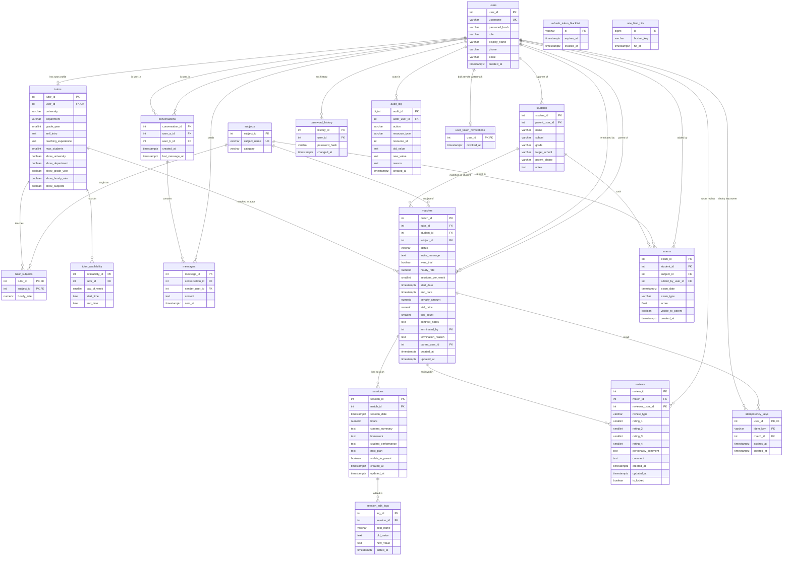

# TMRP Database Schema Reference

**Platform:** PostgreSQL 16  
**Tables:** 19  
**Materialized Views:** 2  
**Triggers / Functions:** 5  

---

## Table of Contents

1. [Domain Overview](#1-domain-overview)
2. [Full Entity-Relationship Diagram](#2-full-entity-relationship-diagram)
3. [Table Reference](#3-table-reference)
   - 3.1 [Identity & Authorization](#31-identity--authorization)
   - 3.2 [Teaching Catalog](#32-teaching-catalog)
   - 3.3 [Messaging](#33-messaging)
   - 3.4 [Matching & Contracts](#34-matching--contracts)
   - 3.5 [Teaching Records](#35-teaching-records)
   - 3.6 [Reviews & Ratings](#36-reviews--ratings)
   - 3.7 [Infrastructure](#37-infrastructure)
4. [Materialized Views](#4-materialized-views)
5. [Triggers & Functions](#5-triggers--functions)
6. [Index Reference](#6-index-reference)
7. [Constraint Reference](#7-constraint-reference)
8. [Data Type Rationale](#8-data-type-rationale)

---

## 1. Domain Overview

| Domain | Tables | Description |
|--------|--------|-------------|
| Identity & Authorization | `users`, `tutors`, `students`, `refresh_token_blacklist`, `password_history` | Accounts, role profiles, JWT revocation, password reuse prevention |
| Teaching Catalog | `subjects`, `tutor_subjects`, `tutor_availability` | Subject taxonomy, tutor pricing, weekly schedule |
| Messaging | `conversations`, `messages` | Direct messaging between any two users |
| Matching & Contracts | `matches` | Full tutoring engagement lifecycle (pending → ended) |
| Teaching Records | `sessions`, `session_edit_logs`, `exams` | Session logs, edit audit trail, exam scores |
| Reviews & Ratings | `reviews` | Post-match multi-dimension ratings |
| Infrastructure | `rate_limit_hits`, `audit_log`, `idempotency_keys`, `user_token_revocations` | API rate limiting, privileged-action audit trail, match-creation idempotency, bulk token revocation |

---

## 2. Full Entity-Relationship Diagram



---

## 3. Table Reference

### 3.1 Identity & Authorization

#### `users`

The central account table. Every actor in the system — parent, tutor, or admin — has exactly one row here.

| Column | Type | Constraints | Default | Notes |
|--------|------|-------------|---------|-------|
| `user_id` | `SERIAL` | PK | auto | |
| `username` | `VARCHAR(100)` | NOT NULL, UNIQUE | — | Login identifier; `idx_users_username` |
| `password_hash` | `VARCHAR(255)` | NOT NULL | — | Bcrypt hash |
| `role` | `VARCHAR(10)` | NOT NULL, CHECK | — | `chk_users_role`: `'parent'` / `'tutor'` / `'admin'` |
| `display_name` | `VARCHAR(100)` | NOT NULL | — | Shown in UI |
| `phone` | `VARCHAR(30)` | nullable | — | |
| `email` | `VARCHAR(100)` | nullable, CHECK | — | `chk_users_email_format` (`email LIKE '%@%'`); unique when not null via `idx_users_email` |
| `created_at` | `TIMESTAMPTZ` | NOT NULL | `NOW()` | |

**Outgoing FK references from other tables:** `tutors.user_id`, `students.parent_user_id`, `conversations.user_a_id`, `conversations.user_b_id`, `messages.sender_user_id`, `matches.terminated_by`, `matches.parent_user_id`, `exams.added_by_user_id`, `reviews.reviewer_user_id`, `audit_log.actor_user_id`

---

#### `tutors`

Extended profile for users with `role = 'tutor'`. One-to-one with `users`.

| Column | Type | Constraints | Default | Notes |
|--------|------|-------------|---------|-------|
| `tutor_id` | `SERIAL` | PK | auto | |
| `user_id` | `INTEGER` | NOT NULL, FK → `users`, UNIQUE | — | 1:1 link; `idx_tutors_user_id`; CASCADE delete |
| `university` | `VARCHAR(50)` | nullable | — | |
| `department` | `VARCHAR(50)` | nullable | — | |
| `grade_year` | `SMALLINT` | nullable | — | Year of study |
| `self_intro` | `TEXT` | nullable | — | |
| `teaching_experience` | `TEXT` | nullable | — | |
| `max_students` | `SMALLINT` | — | `5` | Checked against `v_tutor_active_students` |
| `show_university` | `BOOLEAN` | — | `TRUE` | Visibility flag |
| `show_department` | `BOOLEAN` | — | `TRUE` | Visibility flag |
| `show_grade_year` | `BOOLEAN` | — | `TRUE` | Visibility flag |
| `show_hourly_rate` | `BOOLEAN` | — | `TRUE` | Visibility flag |
| `show_subjects` | `BOOLEAN` | — | `TRUE` | Visibility flag |

**On delete:** `ON DELETE CASCADE` from `users` — deleting a user removes their tutor profile.

---

#### `students`

Children managed by a parent user. One parent may have multiple students.

| Column | Type | Constraints | Default | Notes |
|--------|------|-------------|---------|-------|
| `student_id` | `SERIAL` | PK | auto | |
| `parent_user_id` | `INTEGER` | NOT NULL, FK → `users` | — | `idx_students_parent`; CASCADE delete |
| `name` | `VARCHAR(50)` | NOT NULL | — | |
| `school` | `VARCHAR(50)` | nullable | — | |
| `grade` | `VARCHAR(20)` | nullable | — | |
| `target_school` | `VARCHAR(50)` | nullable | — | |
| `parent_phone` | `VARCHAR(20)` | nullable | — | May differ from `users.phone` |
| `notes` | `TEXT` | nullable | — | |

**On delete:** `ON DELETE CASCADE` from `users` — deleting a parent removes all their students.

---

#### `refresh_token_blacklist`

Shared revocation list for JWT refresh tokens, consulted by all API workers.

| Column | Type | Constraints | Default | Notes |
|--------|------|-------------|---------|-------|
| `jti` | `VARCHAR(64)` | PK | — | JWT ID claim |
| `expires_at` | `TIMESTAMPTZ` | NOT NULL | — | Row can be pruned after this time; `idx_rt_blacklist_exp` |
| `created_at` | `TIMESTAMPTZ` | NOT NULL | `NOW()` | |

**No foreign keys.** Standalone infrastructure table.

---

#### `password_history`

Recent bcrypt hashes per user, retained for password reuse enforcement. At most five entries are kept per user; older rows are pruned on every write.

| Column | Type | Constraints | Default | Notes |
|--------|------|-------------|---------|-------|
| `history_id` | `SERIAL` | PK | auto | |
| `user_id` | `INTEGER` | NOT NULL, FK → `users` | — | `idx_pw_history_user`; CASCADE delete |
| `password_hash` | `VARCHAR(255)` | NOT NULL | — | Bcrypt hash of a previous password |
| `changed_at` | `TIMESTAMPTZ` | NOT NULL | `NOW()` | `idx_pw_history_user (user_id, changed_at DESC)` |

**On delete:** `ON DELETE CASCADE` from `users` — deleting an account removes all history entries.

---

### 3.2 Teaching Catalog

#### `subjects`

Master taxonomy of teachable subjects. Seeded at init; protected from deletion while referenced.

| Column | Type | Constraints | Default | Notes |
|--------|------|-------------|---------|-------|
| `subject_id` | `SERIAL` | PK | auto | |
| `subject_name` | `VARCHAR(30)` | NOT NULL, UNIQUE | — | `idx_subjects_name` |
| `category` | `VARCHAR(30)` | NOT NULL, CHECK | — | `'math'` / `'science'` / `'lang'` / `'other'` |

**Seed data:** 數學 (math); 物理, 化學, 生物, 地球科學 (science); 國文, 英文, 日文 (lang); 歷史, 地理, 公民, 程式設計 (other)

---

#### `tutor_subjects`

Junction table resolving the many-to-many between `tutors` and `subjects`, with per-subject hourly rate.

| Column | Type | Constraints | Default | Notes |
|--------|------|-------------|---------|-------|
| `tutor_id` | `INTEGER` | PK, FK → `tutors` | — | CASCADE delete; composite PK |
| `subject_id` | `INTEGER` | PK, FK → `subjects` | — | RESTRICT delete; composite PK; `idx_tutor_subjects_subject` |
| `hourly_rate` | `NUMERIC(12,2)` | NOT NULL | — | Monetary — no floating-point representation |

**On delete:** tutor delete cascades; subject delete is restricted while any tutor teaches it.

---

#### `tutor_availability`

Weekly recurring time slots. Each row represents one day-of-week window for a tutor.

| Column | Type | Constraints | Default | Notes |
|--------|------|-------------|---------|-------|
| `availability_id` | `SERIAL` | PK | auto | |
| `tutor_id` | `INTEGER` | NOT NULL, FK → `tutors` | — | `idx_tutor_avail_tutor`; CASCADE delete |
| `day_of_week` | `SMALLINT` | NOT NULL, CHECK 1–7 | — | Application convention: 1 = Monday … 7 = Sunday |
| `start_time` | `TIME` | NOT NULL | — | Wall-clock time (no date — slot recurs weekly) |
| `end_time` | `TIME` | NOT NULL, CHECK > start | — | `chk_tutor_availability_time_order` |

**Unique index:** `idx_tutor_avail_slot (tutor_id, day_of_week, start_time)` — blocks duplicate slots from concurrent inserts or direct DB writes.

---

### 3.3 Messaging

#### `conversations`

Canonical thread between exactly two users. The pair-order constraint and unique index prevent duplicate threads.

| Column | Type | Constraints | Default | Notes |
|--------|------|-------------|---------|-------|
| `conversation_id` | `SERIAL` | PK | auto | |
| `user_a_id` | `INTEGER` | NOT NULL, FK → `users` | — | Always the lower `user_id`; CASCADE delete |
| `user_b_id` | `INTEGER` | NOT NULL, FK → `users` | — | Always the higher `user_id`; CASCADE delete |
| `created_at` | `TIMESTAMPTZ` | NOT NULL | `NOW()` | |
| `last_message_at` | `TIMESTAMPTZ` | nullable | — | Updated by application on each new message; `idx_conv_last_msg` |

**Unique index:** `idx_conversations_pair (user_a_id, user_b_id)` — one thread per pair.  
**Check:** `user_a_id < user_b_id` — prevents reversed or self-referential pairs.  
**Trigger:** `fn_conversations_order_pair` (BEFORE INSERT/UPDATE) auto-swaps if caller passes wrong order.

---

#### `messages`

Individual messages within a conversation thread.

| Column | Type | Constraints | Default | Notes |
|--------|------|-------------|---------|-------|
| `message_id` | `SERIAL` | PK | auto | |
| `conversation_id` | `INTEGER` | NOT NULL, FK → `conversations` | — | `idx_messages_conv`; CASCADE delete |
| `sender_user_id` | `INTEGER` | NOT NULL, FK → `users` | — | `idx_messages_sender`; CASCADE delete |
| `content` | `TEXT` | NOT NULL | — | |
| `sent_at` | `TIMESTAMPTZ` | NOT NULL | `NOW()` | `idx_messages_sent_at` |

---

### 3.4 Matching & Contracts

#### `matches`

Core business entity. Represents the full lifecycle of a tutoring engagement from initial inquiry to completion or termination. All monetary-adjacent FKs use `ON DELETE RESTRICT` to protect legal/billing records.

| Column | Type | Constraints | Default | Notes |
|--------|------|-------------|---------|-------|
| `match_id` | `SERIAL` | PK | auto | |
| `tutor_id` | `INTEGER` | NOT NULL, FK → `tutors` | — | RESTRICT delete; `idx_matches_tutor` |
| `student_id` | `INTEGER` | NOT NULL, FK → `students` | — | RESTRICT delete; `idx_matches_student` |
| `subject_id` | `INTEGER` | NOT NULL, FK → `subjects` | — | RESTRICT delete |
| `status` | `VARCHAR(15)` | NOT NULL | `'pending'` | See status lifecycle below; `idx_matches_status` |
| `invite_message` | `TEXT` | nullable | — | Parent's initial message to tutor |
| `want_trial` | `BOOLEAN` | — | `FALSE` | Whether a trial session was requested |
| `hourly_rate` | `NUMERIC(12,2)` | nullable | — | Agreed rate; locked at contract stage |
| `sessions_per_week` | `SMALLINT` | nullable | — | |
| `start_date` | `TIMESTAMPTZ` | nullable | — | Contract start |
| `end_date` | `TIMESTAMPTZ` | nullable | — | Contract end |
| `penalty_amount` | `NUMERIC(12,2)` | nullable | — | Early termination penalty |
| `trial_price` | `NUMERIC(12,2)` | nullable | — | |
| `trial_count` | `SMALLINT` | nullable | — | |
| `contract_notes` | `TEXT` | nullable | — | |
| `terminated_by` | `INTEGER` | FK → `users`, nullable | — | RESTRICT delete; audit trail; `idx_matches_terminated_by` |
| `termination_reason` | `TEXT` | nullable | — | Stored as `"{previous_status}\|{reason}"` |
| `parent_user_id` | `INTEGER` | FK → `users`, nullable | — | RESTRICT delete; denormalized from `students`; `idx_matches_parent` |
| `created_at` | `TIMESTAMPTZ` | NOT NULL | `NOW()` | |
| `updated_at` | `TIMESTAMPTZ` | NOT NULL | `NOW()` | `idx_matches_status_updated` |

**Status lifecycle:**

```
pending ──► trial ──► active ──► paused ──► terminating ──► ended
   │                    │                                      ▲
   └──► rejected        └──────────────────────────────────────┘
   │
   └──► cancelled
```

Valid statuses (enforced by `chk_matches_status`): `'pending'`, `'trial'`, `'active'`, `'paused'`, `'cancelled'`, `'rejected'`, `'terminating'`, `'ended'`

**Unique index:** `idx_matches_one_active (tutor_id, student_id, subject_id) WHERE status IN ('pending','trial','active','paused','terminating')` — DB-level guard against the TOCTOU race in duplicate-active detection. Terminal statuses (`ended`, `cancelled`, `rejected`) can coexist for the same triple.

**Triggers:**
- `fn_match_set_parent_user` (BEFORE INSERT/UPDATE OF `student_id`) — auto-populates `parent_user_id` from `students.parent_user_id`
- `fn_students_propagate_parent` (AFTER UPDATE OF `parent_user_id` on `students`) — syncs ownership change to all related matches

---

### 3.5 Teaching Records

#### `sessions`

Individual teaching sessions logged by tutors under a match.

| Column | Type | Constraints | Default | Notes |
|--------|------|-------------|---------|-------|
| `session_id` | `SERIAL` | PK | auto | |
| `match_id` | `INTEGER` | NOT NULL, FK → `matches` | — | `idx_sessions_match`; CASCADE delete |
| `session_date` | `TIMESTAMPTZ` | NOT NULL | — | `idx_sessions_match_date` |
| `hours` | `NUMERIC(10,2)` | NOT NULL, CHECK > 0 | — | NUMERIC prevents 0.1+0.2 floating-point errors |
| `content_summary` | `TEXT` | NOT NULL | — | |
| `homework` | `TEXT` | nullable | — | |
| `student_performance` | `TEXT` | nullable | — | |
| `next_plan` | `TEXT` | nullable | — | |
| `visible_to_parent` | `BOOLEAN` | — | `FALSE` | Gates parent read access; `idx_sessions_match_visible` |
| `created_at` | `TIMESTAMPTZ` | NOT NULL | `NOW()` | `idx_sessions_created` |
| `updated_at` | `TIMESTAMPTZ` | NOT NULL | `NOW()` | |

---

#### `session_edit_logs`

Field-level audit trail for every change made to a session record.

| Column | Type | Constraints | Default | Notes |
|--------|------|-------------|---------|-------|
| `log_id` | `SERIAL` | PK | auto | |
| `session_id` | `INTEGER` | NOT NULL, FK → `sessions` | — | `idx_session_edit_logs_sess`; CASCADE delete |
| `field_name` | `VARCHAR(50)` | NOT NULL | — | Name of the changed field |
| `old_value` | `TEXT` | nullable | — | Pre-change value serialized as text |
| `new_value` | `TEXT` | nullable | — | Post-change value serialized as text |
| `edited_at` | `TIMESTAMPTZ` | NOT NULL | `NOW()` | |

---

#### `exams`

Exam scores recorded by tutors for students. Protected from orphaning via RESTRICT on `subjects` and `users`.

| Column | Type | Constraints | Default | Notes |
|--------|------|-------------|---------|-------|
| `exam_id` | `SERIAL` | PK | auto | |
| `student_id` | `INTEGER` | NOT NULL, FK → `students` | — | `idx_exams_student`; CASCADE delete |
| `subject_id` | `INTEGER` | NOT NULL, FK → `subjects` | — | `idx_exams_subject`; RESTRICT delete |
| `added_by_user_id` | `INTEGER` | NOT NULL, FK → `users` | — | `idx_exams_added_by`; RESTRICT delete; audit who entered the record |
| `exam_date` | `TIMESTAMPTZ` | NOT NULL | — | `idx_exams_student_date DESC` |
| `exam_type` | `VARCHAR(20)` | NOT NULL, CHECK | — | `'段考'` / `'小考'` / `'模擬考'` / `'其他'` |
| `score` | `DOUBLE PRECISION` | NOT NULL | — | Non-monetary; DOUBLE PRECISION acceptable |
| `visible_to_parent` | `BOOLEAN` | — | `FALSE` | Gates parent read access |
| `created_at` | `TIMESTAMPTZ` | NOT NULL | `NOW()` | |

---

### 3.6 Reviews & Ratings

#### `reviews`

Post-engagement multi-dimension ratings. One review per (match, reviewer, type) triplet, enforced by unique index.

| Column | Type | Constraints | Default | Notes |
|--------|------|-------------|---------|-------|
| `review_id` | `SERIAL` | PK | auto | |
| `match_id` | `INTEGER` | NOT NULL, FK → `matches` | — | `idx_reviews_match`; CASCADE delete |
| `reviewer_user_id` | `INTEGER` | NOT NULL, FK → `users` | — | `idx_reviews_reviewer`; RESTRICT delete (preserve audit) |
| `review_type` | `VARCHAR(20)` | NOT NULL, CHECK | — | `'parent_to_tutor'` / `'tutor_to_parent'` / `'tutor_to_student'` |
| `rating_1` | `SMALLINT` | NOT NULL, CHECK 1–5 | — | Required dimension |
| `rating_2` | `SMALLINT` | NOT NULL, CHECK 1–5 | — | Required dimension |
| `rating_3` | `SMALLINT` | CHECK NULL OR 1–5 | — | Optional dimension |
| `rating_4` | `SMALLINT` | CHECK NULL OR 1–5 | — | Optional dimension |
| `personality_comment` | `TEXT` | nullable | — | |
| `comment` | `TEXT` | nullable | — | |
| `created_at` | `TIMESTAMPTZ` | NOT NULL | `NOW()` | |
| `updated_at` | `TIMESTAMPTZ` | nullable | — | Set on edit |
| `is_locked` | `BOOLEAN` | — | `FALSE` | Locked after 7-day window by scheduled task |

**Unique index:** `idx_reviews_unique (match_id, reviewer_user_id, review_type)` — one review per reviewer per match per type.  
**Trigger:** `fn_refresh_tutor_ratings` (AFTER INSERT/UPDATE/DELETE) — refreshes `v_tutor_ratings` materialized view.

---

### 3.7 Infrastructure

#### `rate_limit_hits`

Sliding-window rate limit bucket store, shared across API workers. Uses `BIGSERIAL` for high write volume.

| Column | Type | Constraints | Default | Notes |
|--------|------|-------------|---------|-------|
| `id` | `BIGSERIAL` | PK | auto | |
| `bucket_key` | `VARCHAR(255)` | NOT NULL | — | Composite key: e.g. `"user:42:POST:/matches"` |
| `hit_at` | `TIMESTAMPTZ` | NOT NULL | `NOW()` | `idx_rl_bucket_hit_at (bucket_key, hit_at)` for window scans |
| `expires_at` | `TIMESTAMPTZ` | NOT NULL | — | Used for TTL-based pruning |

**No foreign keys.** Standalone infrastructure table.

---

#### `audit_log`

Privileged-action audit trail. Uses `ON DELETE SET NULL` so records survive actor deletion.

| Column | Type | Constraints | Default | Notes |
|--------|------|-------------|---------|-------|
| `audit_id` | `BIGSERIAL` | PK | auto | |
| `actor_user_id` | `INTEGER` | FK → `users`, nullable | — | SET NULL on user delete; `idx_audit_log_actor` |
| `action` | `VARCHAR(50)` | NOT NULL | — | e.g. `'match_status_change'` |
| `resource_type` | `VARCHAR(50)` | NOT NULL | — | e.g. `'match'` |
| `resource_id` | `INTEGER` | nullable | — | Soft reference — no FK; row survives target deletion |
| `old_value` | `TEXT` | nullable | — | |
| `new_value` | `TEXT` | nullable | — | |
| `reason` | `TEXT` | nullable | — | |
| `created_at` | `TIMESTAMPTZ` | NOT NULL | `NOW()` | `idx_audit_log_resource (resource_type, resource_id)` |

---

#### `idempotency_keys`

DB-backed idempotency store for match creation. Ensures a retried request with the same `Idempotency-Key` header returns the original result rather than creating a duplicate match.

| Column | Type | Constraints | Default | Notes |
|--------|------|-------------|---------|-------|
| `user_id` | `INTEGER` | PK (composite), FK → `users` | — | CASCADE delete; part of composite PK |
| `idem_key` | `VARCHAR(128)` | PK (composite), NOT NULL | — | Client-supplied idempotency key |
| `match_id` | `INTEGER` | NOT NULL, FK → `matches` | — | The match that was created; CASCADE delete |
| `expires_at` | `TIMESTAMPTZ` | NOT NULL | — | `idx_idempotency_expires (expires_at)` for TTL pruning |
| `created_at` | `TIMESTAMPTZ` | NOT NULL | `NOW()` | |

**Primary key:** `(user_id, idem_key)`.

---

#### `user_token_revocations`

Records a per-user "revoke all tokens issued before this timestamp" watermark. Used when an admin force-resets a user's password so existing access tokens are invalidated immediately.

| Column | Type | Constraints | Default | Notes |
|--------|------|-------------|---------|-------|
| `user_id` | `INTEGER` | PK, FK → `users` | — | CASCADE delete; one row per user |
| `revoked_at` | `TIMESTAMPTZ` | NOT NULL | `NOW()` | Tokens issued before this time are rejected |

---

## 4. Materialized Views

### `v_tutor_ratings`

Pre-aggregated average ratings per tutor, refreshed synchronously by trigger after any review write.

```sql
SELECT m.tutor_id,
       AVG(r.rating_1) AS avg_r1,
       AVG(r.rating_2) AS avg_r2,
       AVG(r.rating_3) AS avg_r3,
       AVG(r.rating_4) AS avg_r4,
       COUNT(*)        AS review_count,
       -- Mean of whichever dimensions were actually rated.
       -- Returns NULL (not 0) when no rated reviews exist, so unreviewed
       -- tutors are not ranked below tutors with genuine low scores.
       CASE WHEN COUNT(r.review_id) = 0 THEN NULL ELSE
         (COALESCE(AVG(r.rating_1), 0) + COALESCE(AVG(r.rating_2), 0)
        + COALESCE(AVG(r.rating_3), 0) + COALESCE(AVG(r.rating_4), 0))
        / NULLIF(
            (CASE WHEN AVG(r.rating_1) IS NOT NULL THEN 1 ELSE 0 END)
          + (CASE WHEN AVG(r.rating_2) IS NOT NULL THEN 1 ELSE 0 END)
          + (CASE WHEN AVG(r.rating_3) IS NOT NULL THEN 1 ELSE 0 END)
          + (CASE WHEN AVG(r.rating_4) IS NOT NULL THEN 1 ELSE 0 END)
        , 0)
       END AS avg_rating
FROM reviews r
INNER JOIN matches m ON r.match_id = m.match_id
WHERE r.review_type = 'parent_to_tutor'
GROUP BY m.tutor_id
```

| Detail | Value |
|--------|-------|
| Source tables | `reviews`, `matches` |
| Filter | `review_type = 'parent_to_tutor'` only |
| Granularity | One row per tutor with at least one review (INNER JOIN) |
| Unique index | `idx_mv_tutor_ratings_tutor (tutor_id)` |
| Refresh trigger | `fn_refresh_tutor_ratings` (AFTER INSERT / UPDATE / DELETE on `reviews`) |
| Purpose | Eliminates N+1 subqueries on tutor listing; converts aggregation to single-row lookup |

---

### `v_tutor_active_students`

Current active student count per tutor; used to enforce `tutors.max_students`.

```sql
SELECT tutor_id, COUNT(*) AS active_count
FROM matches
WHERE status IN ('active', 'trial')
GROUP BY tutor_id
```

| Detail | Value |
|--------|-------|
| Source table | `matches` |
| Filter | `status IN ('active', 'trial')` |
| Granularity | One row per tutor with at least one active/trial match |
| Unique index | `idx_mv_tutor_active_tutor (tutor_id)` |
| Refresh trigger | `fn_refresh_tutor_active_students` (AFTER INSERT / UPDATE OF `status` / DELETE on `matches`) |
| Purpose | O(1) capacity check instead of `COUNT(*)` table scan |

---

## 5. Triggers & Functions

| Function | Event | Table | Timing | Purpose |
|----------|-------|-------|--------|---------|
| `fn_refresh_tutor_ratings` | INSERT, UPDATE, DELETE | `reviews` | AFTER | Refreshes `v_tutor_ratings` |
| `fn_refresh_tutor_active_students` | INSERT, UPDATE OF `status`, DELETE | `matches` | AFTER | Refreshes `v_tutor_active_students` |
| `fn_match_set_parent_user` | INSERT, UPDATE OF `student_id` | `matches` | BEFORE | Populates `matches.parent_user_id` from `students.parent_user_id` |
| `fn_students_propagate_parent` | UPDATE OF `parent_user_id` | `students` | AFTER | Syncs ownership change to all related `matches` rows |
| `fn_conversations_order_pair` | INSERT, UPDATE | `conversations` | BEFORE | Normalizes `user_a_id < user_b_id` by swapping if caller passes wrong order |

---

## 6. Index Reference

### Unique Indexes

| Index Name | Table | Columns | Enforces |
|------------|-------|---------|----------|
| `idx_users_username` | `users` | `username` | One account per username |
| `idx_users_email` | `users` | `email WHERE email IS NOT NULL` | At most one account per non-null email (partial unique) |
| `idx_tutors_user_id` | `tutors` | `user_id` | 1:1 user–tutor relationship |
| `idx_subjects_name` | `subjects` | `subject_name` | No duplicate subjects |
| `idx_tutor_avail_slot` | `tutor_availability` | `(tutor_id, day_of_week, start_time)` | No duplicate availability slots |
| `idx_conversations_pair` | `conversations` | `(user_a_id, user_b_id)` | One thread per user pair |
| `idx_matches_one_active` | `matches` | `(tutor_id, student_id, subject_id) WHERE status IN ('pending','trial','active','paused','terminating')` | One active match per (tutor, student, subject) triple (partial unique) |
| `idx_reviews_unique` | `reviews` | `(match_id, reviewer_user_id, review_type)` | One review per reviewer per match per type |
| `idx_mv_tutor_ratings_tutor` | `v_tutor_ratings` | `tutor_id` | Fast MV lookup |
| `idx_mv_tutor_active_tutor` | `v_tutor_active_students` | `tutor_id` | Fast MV lookup |

### Performance Indexes

| Index Name | Table | Columns | Supports |
|------------|-------|---------|----------|
| `idx_students_parent` | `students` | `parent_user_id` | Parent's student list |
| `idx_tutor_avail_tutor` | `tutor_availability` | `tutor_id` | Tutor schedule lookup |
| `idx_tutor_subjects_subject` | `tutor_subjects` | `subject_id` | Subject-based tutor search |
| `idx_conversations_user_a` | `conversations` | `user_a_id` | Inbox query |
| `idx_conversations_user_b` | `conversations` | `user_b_id` | Inbox query |
| `idx_conv_last_msg` | `conversations` | `last_message_at` | Sort by recent activity |
| `idx_messages_conv` | `messages` | `conversation_id` | Thread message list |
| `idx_messages_sent_at` | `messages` | `sent_at` | Chronological sort |
| `idx_messages_sender` | `messages` | `sender_user_id` | Sender history |
| `idx_matches_tutor` | `matches` | `tutor_id` | Tutor's match list |
| `idx_matches_student` | `matches` | `student_id` | Student's match list |
| `idx_matches_status` | `matches` | `status` | Status filter |
| `idx_matches_parent` | `matches` | `parent_user_id` | Parent's match list |
| `idx_matches_parent_status` | `matches` | `(parent_user_id, status)` | Filtered parent match list |
| `idx_matches_status_updated` | `matches` | `(status, updated_at)` | Status + recency sort |
| `idx_matches_terminated_by` | `matches` | `terminated_by` | Admin audit queries |
| `idx_sessions_match` | `sessions` | `match_id` | Session list per match |
| `idx_sessions_created` | `sessions` | `created_at` | Chronological sort |
| `idx_sessions_match_date` | `sessions` | `(match_id, session_date)` | Date-range queries |
| `idx_sessions_match_visible` | `sessions` | `(match_id, visible_to_parent) INCLUDE (session_date)` | Parent visibility filter |
| `idx_session_edit_logs_sess` | `session_edit_logs` | `session_id` | Edit history per session |
| `idx_exams_student` | `exams` | `student_id` | Student's exam list |
| `idx_exams_added_by` | `exams` | `added_by_user_id` | Audit by recorder |
| `idx_exams_subject` | `exams` | `subject_id` | Subject filter |
| `idx_exams_student_date` | `exams` | `(student_id, exam_date DESC)` | Most-recent N exams |
| `idx_reviews_match` | `reviews` | `match_id` | Reviews for a match |
| `idx_reviews_reviewer` | `reviews` | `reviewer_user_id` | Reviews by a user |
| `idx_audit_log_resource` | `audit_log` | `(resource_type, resource_id)` | Resource history lookup |
| `idx_audit_log_actor` | `audit_log` | `(actor_user_id, created_at)` | Actor history lookup |
| `idx_rl_bucket_hit_at` | `rate_limit_hits` | `(bucket_key, hit_at)` | Sliding-window count |
| `idx_rl_expires_at` | `rate_limit_hits` | `expires_at` | TTL-based pruning of expired buckets |
| `idx_rt_blacklist_exp` | `refresh_token_blacklist` | `expires_at` | Expired token pruning |
| `idx_idempotency_expires` | `idempotency_keys` | `expires_at` | TTL-based pruning |
| `idx_pw_history_user` | `password_history` | `(user_id, changed_at DESC)` | Most-recent N hashes per user |

---

## 7. Constraint Reference

### CHECK Constraints

| Table | Constraint Name | Expression |
|-------|----------------|------------|
| `users` | `chk_users_role` | `role IN ('parent', 'tutor', 'admin')` |
| `users` | `chk_users_email_format` | `email IS NULL OR email LIKE '%@%'` |
| `subjects` | `chk_subject_category` | `category IN ('math', 'science', 'lang', 'other')` |
| `tutor_availability` | *(inline)* | `day_of_week >= 1 AND day_of_week <= 7` |
| `tutor_availability` | `chk_tutor_availability_time_order` | `start_time < end_time` |
| `conversations` | `chk_conversations_pair_order` | `user_a_id < user_b_id` |
| `matches` | `chk_matches_status` | `status IN ('pending','trial','active','paused','terminating','ended','cancelled','rejected')` |
| `sessions` | *(inline)* | `hours > 0` |
| `exams` | *(inline)* | `exam_type IN ('段考', '小考', '模擬考', '其他')` |
| `reviews` | *(inline)* | `review_type IN ('parent_to_tutor', 'tutor_to_parent', 'tutor_to_student')` |
| `reviews` | *(inline)* | `rating_1 BETWEEN 1 AND 5` |
| `reviews` | *(inline)* | `rating_2 BETWEEN 1 AND 5` |
| `reviews` | *(inline)* | `rating_3 IS NULL OR rating_3 BETWEEN 1 AND 5` |
| `reviews` | *(inline)* | `rating_4 IS NULL OR rating_4 BETWEEN 1 AND 5` |

### Foreign Key Summary

| From | Column | → To | Column | On Delete | Reason |
|------|--------|------|--------|-----------|--------|
| `tutors` | `user_id` | `users` | `user_id` | CASCADE | Remove profile with account |
| `students` | `parent_user_id` | `users` | `user_id` | CASCADE | Remove children with account |
| `tutor_subjects` | `tutor_id` | `tutors` | `tutor_id` | CASCADE | Remove rates with tutor |
| `tutor_subjects` | `subject_id` | `subjects` | `subject_id` | RESTRICT | Protect subject catalogue |
| `tutor_availability` | `tutor_id` | `tutors` | `tutor_id` | CASCADE | Remove slots with tutor |
| `conversations` | `user_a_id` | `users` | `user_id` | CASCADE | Remove thread with participant |
| `conversations` | `user_b_id` | `users` | `user_id` | CASCADE | Remove thread with participant |
| `messages` | `conversation_id` | `conversations` | `conversation_id` | CASCADE | Remove messages with thread |
| `messages` | `sender_user_id` | `users` | `user_id` | CASCADE | Remove messages with sender |
| `matches` | `tutor_id` | `tutors` | `tutor_id` | RESTRICT | Legal / billing record |
| `matches` | `student_id` | `students` | `student_id` | RESTRICT | Legal / billing record |
| `matches` | `subject_id` | `subjects` | `subject_id` | RESTRICT | Protect subject reference |
| `matches` | `terminated_by` | `users` | `user_id` | RESTRICT | Audit trail — who terminated |
| `matches` | `parent_user_id` | `users` | `user_id` | RESTRICT | Denormalized ownership |
| `sessions` | `match_id` | `matches` | `match_id` | CASCADE | Teaching records follow match |
| `session_edit_logs` | `session_id` | `sessions` | `session_id` | CASCADE | Edit log follows session |
| `exams` | `student_id` | `students` | `student_id` | CASCADE | Exams follow student |
| `exams` | `subject_id` | `subjects` | `subject_id` | RESTRICT | Protect subject reference |
| `exams` | `added_by_user_id` | `users` | `user_id` | RESTRICT | Audit — who recorded |
| `reviews` | `match_id` | `matches` | `match_id` | CASCADE | Reviews follow match |
| `reviews` | `reviewer_user_id` | `users` | `user_id` | RESTRICT | Preserve reviewer audit trail |
| `password_history` | `user_id` | `users` | `user_id` | CASCADE | Remove history with account |
| `audit_log` | `actor_user_id` | `users` | `user_id` | SET NULL | Record survives actor deletion |
| `idempotency_keys` | `user_id` | `users` | `user_id` | CASCADE | Remove keys with account |
| `idempotency_keys` | `match_id` | `matches` | `match_id` | CASCADE | Key tied to its created match |
| `user_token_revocations` | `user_id` | `users` | `user_id` | CASCADE | Remove watermark with account |

---

## 8. Data Type Rationale

| Choice | Applied To | Reason |
|--------|-----------|--------|
| `NUMERIC(12,2)` | Monetary values (`hourly_rate`, `penalty_amount`, `trial_price`) | Exact decimal arithmetic; avoids IEEE 754 floating-point errors in financial calculations |
| `NUMERIC(10,2)` | `sessions.hours` | Same reason — hours feed into payment calculations |
| `DOUBLE PRECISION` | `exams.score` | Non-monetary; precision sufficient; no arithmetic compounding |
| `TIMESTAMPTZ` | All timestamp columns | Timezone-aware; safe for a platform that may operate across timezones |
| `TIME` (not `TIMESTAMPTZ`) | `tutor_availability.start_time / end_time` | Slots recur weekly; storing time-only avoids calendar-date confusion |
| `BIGSERIAL` | `audit_log.audit_id`, `rate_limit_hits.id` | High write volume; avoids SERIAL integer overflow |
| `SERIAL` | All other PKs | Standard surrogate key for business entity tables |
| `VARCHAR(N)` | Fixed-width string columns | DB-layer length enforcement; predictable storage |
| `TEXT` | Free-form content fields | Unbounded narrative content |
| `BOOLEAN` | Visibility flags, `is_locked`, `want_trial` | Two-state flag with explicit default |
